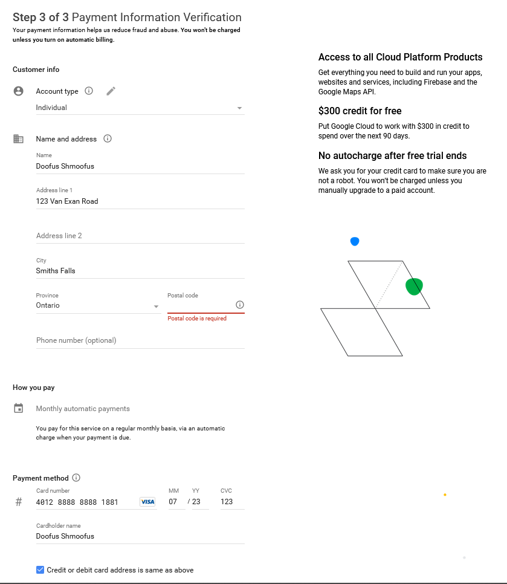
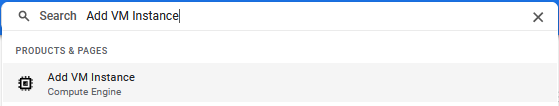
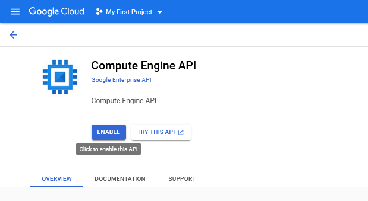
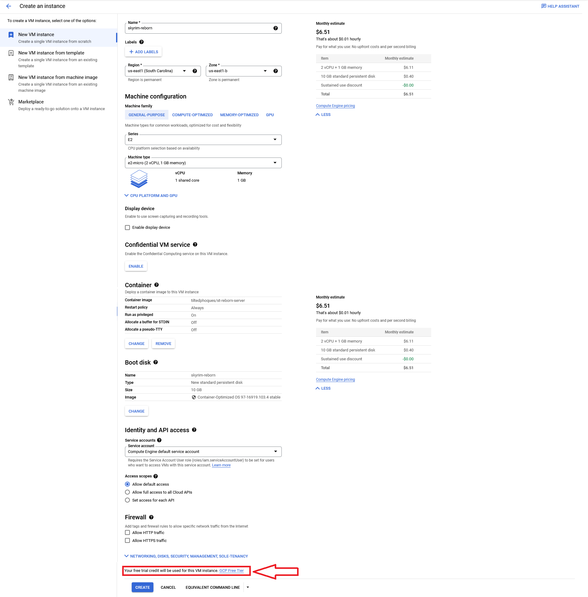
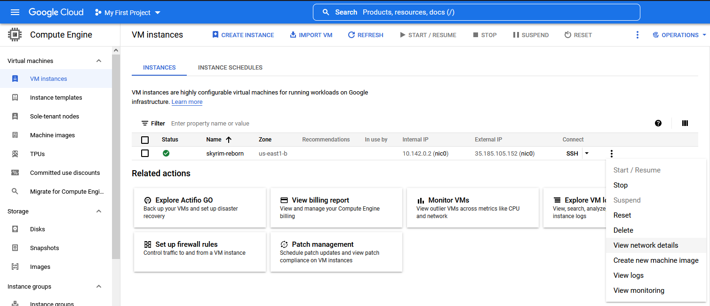
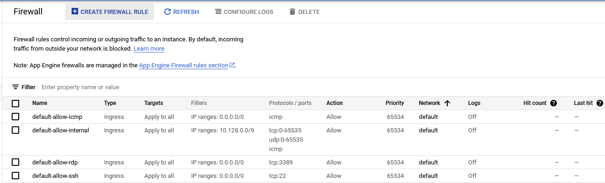
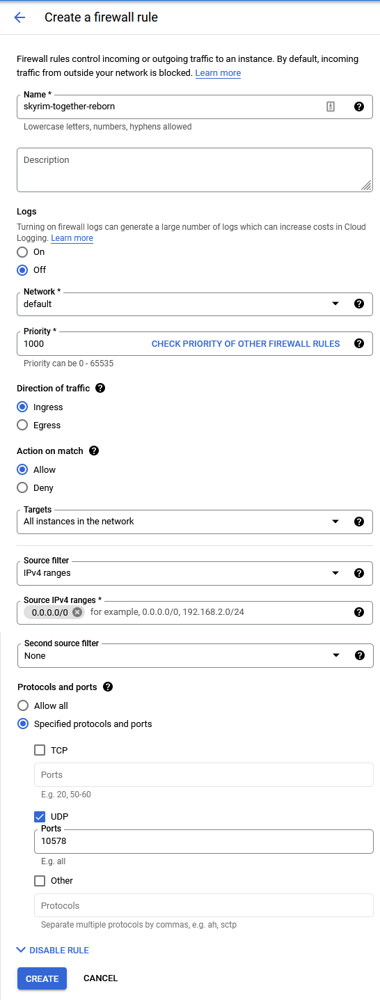

## Free Skyrim Together Reborn Server with Google Cloud
##### Granted you have a credit/debit card

## 1. Account Setup
Setting up an account with Google Cloud is easy, however you will need a form of payment method and a valid phone number for verification. Note: you will not be charged for any services unless you go outside the limitations of the free trial, we will use these free resources to host your server.

### Do not lie on this, you must have a valid credit/debit card, you will not be charged
1. Navigate to <https://console.cloud.google.com/freetrial> and login if prompted
2. Select your Country, select your needs as `Personal Project` (Don't lie), and check the box once you've read the legal documents and continue.
3. Enter your phone number, enter the verification code, and continue.
4. Enter your information as follows, ensuring you select an `Individual` account type and continue: 
5. Close the short survey, and select `SKIP FOR NOW` in the bottom right corner of the tutorial.
6. Your account is now setup! Tutorial continues below.

## 2. VM Setup
Now that you have an account, you're going to want to setup your VM which will host your Skyrim Together Reborn server. This is pretty easy, however it is also easy to make mistakes, I have before.

**MAKE SURE YOU FOLLOW EVERYTHING LAID OUT BELOW TO AVOID CHARGES TO YOUR ACCOUNT!**
1. Navigate to <https://console.cloud.google.com>
2. In the search bar at the top, enter `Add VM Instance` and click on the first result 
3. Select the `ENABLE` button under Compute Engine API and wait for the page to reload
4. You will be prompted with a screen to create a VM instance, enter these details for your cloud instance and ensure these options are selected!
	1. Name: Your Choice
	2. Region: One of `us-east1`, `us-west1`, or `us-central1` as these are the free ones
	3. Zone: Leave on default

	**Machine configuration**
	  1. Machine Family: `GENERAL-PURPOSE`
	  2. Series: `E2`
	  3. Machine type: `e2-micro`

	**Container**
	  1. Click on `DEPLOY CONTAINER`
		  1. Container Image: `tiltedphoques/st-reborn-server`
		  2. Restart policy: `Always`
		  3. Run as privileged: `YES` (this allows it to expose port 10578)
		  4. Click on `SELECT` at the bottom

	**Boot disk**
	  1. Click on `CHANGE`
		  1. Operating system: `Container Optimized OS`
		  2. Version: Default
		  3. Boot disk type: `Standard persistent disk`
		  4. Size (GB): `10`
		  5. Click on `SELECT` at the bottom
	
	**Ensure it reads `Your free trial credit will be used for this VM instance. GCP Free Tier` above the `CREATE` button at the bottom**
### BEFORE YOU PROCEED
### Ensure that all of your settings match those above, reference image below! 
### Assuming you have followed the above instructions correctly, click the blue `CREATE` button at the bottom of your screen, and wait for it to be installed.

## 3. Firewall Setup!
You're in the final stretch now, all you have to do is setup "port forwarding" firewall rules to allow you to access your newly created Skyrim Together Reborn server!
1. Navigate to <https://console.cloud.google.com/compute/instances>
2. Copy the `External IP` from your instance and write it down somewhere, this is the IP you will connect to using your Skyrim Together client.
3. Click the three dots on the right side of your new instance and click `View network details`
4. On the left side, click on `Firewall`
5. At the top of your screen, click on the `+ CREATE FIREWALL RULE` button 
6. Configure your new firewall rule as follows
	1. Name: `skyrim-together-reborn`
	2. Logs: `Off`
	3. Network: `default`
	4. Priority: `1000`
	5. Direction of traffic: `Ingress`
	6. Action on match: `Allow`
	7. Targets: `All instances in the network`
	8. Source filter: `IPv4 ranges`
	9. Source IPv4 ranges: `0.0.0.0/0`
	10. Second source filter: `None`
	11. Protocols and ports: `Specified protocols and ports`
		1. UDP: `10578`
	12. Refer to the image below to ensure identical settings and press the `CREATE` button 

## 4. Grofit!!
### Congratulations, you have setup a Skyrim Together Reborn server for free on Google Cloud Platform!

If you have any questions or concerns, please feel free to reach out to me at
- Discord: *CanadianBacon#5891*
- Email: *bc.bacon.bits@gmail.com*
- Or join the official Skyrim Together Discord server at <https://discord.gg/skyrimtogether>
